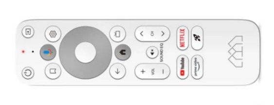

# Homatics Box R 4K Android
By default the apps are installed
Clash
File Manager Plus (not cracked)
CoreElec one click switch
Emotn Store
Dangbei Market
Yei Cao helper

TV is already Android 12

## Basic-Navigation

- Up, Down, Left, Right  - The Wheel
- Enter - Center of the wheel
- Back, Home - Android back and home button
- Ch+ - change channel up; Ch- - change channel down

## Firmware Upgrade
Download: https://mega.nz/folder/YgMBSKCJ#xaZtYaJZ_HGKMRkGDmtMRw/folder/0o0VxAJa
To upgrade, hold the reset pin, replug the power to reboot to recovery mode.
Load the `.zip` firmware file onto a USB, only 1 zip file allowed, the filesystem of USB has to be `FAT32`

adb
Download
https://developer.android.com/tools/releases/platform-tools
Put the files in `C:\platform-tools` and add that to `$PATH`
Enable debugging in Android, find the IP address (preferably DHCP reserved).
```c
adb connect 10.10.120.192
```
When finished adb session use `adb disconnect`

Download Jellyfin, Just Player via Google Play

Go to adb shell via `adb shell` and use this to list all the package names
```c
pm list packages
```
```c
pm uninstall -k --user 0 <package-name>
```

List of problematic apps
```c
com.google.android.youtube.tv
com.google.android.youtube.tvmusic
com.netflix.ninja
com.amazon.amazonvideo.livingroom
```

Disable Default Launcher
```c
adb shell pm disable-user --user 0 com.google.android.tvlauncher
```

Disable Google Play Protect (untested), this is needed to install SmartTube and other Chinese apps
```c
adb shell settings put global package_verifier_user_consent -1
```
Install other launcher/packages
```c
adb install "path_to_android.apk"
```
The install path can be on local directory or SMB share

To change launchers, use the app [Launcher Manager](https://xdaforums.com/t/app-firetv-noroot-launcher-manager-change-launcher-without-root.4176349/)

Remap Buttons
https://4pda.to/forum/index.php?showtopic=807930
3.34 does not work, the latest version is 3.22
Netflix button do not work in any apps.
