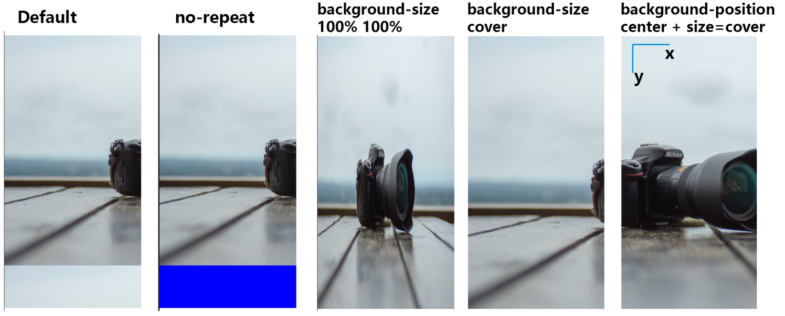

https://developer.mozilla.org/en-US/docs/Web/CSS/background-image
## BG Image
```css
.bg {
  background-image: url(free-images.jpg);
  width: 300px;
  height: 500px;
}
```
- by default, the image will fill the size of container; if the image is too large, it will repeat
```css
background-repeat: no-repeat;
```
- this will make the image show in its native size

**background-size**
```css
background-size: width%/px height %/px | cover;
```
- by setting the size to `cover`, the image will show as is, fill the container but some part of the image will be cropped
	- by default, only the top left portion will be shown unless specified with [position](#^2d4bf8)
- the width/height can be set manually, as % of container or absolute pixel value; the resulting image will be stretched

**background-position** ^2d4bf8
``` css
background-position: x px, y px | top/bottom left/right/center
```
The x, y value in px or % indicate how far from left and top will the image be placed.

