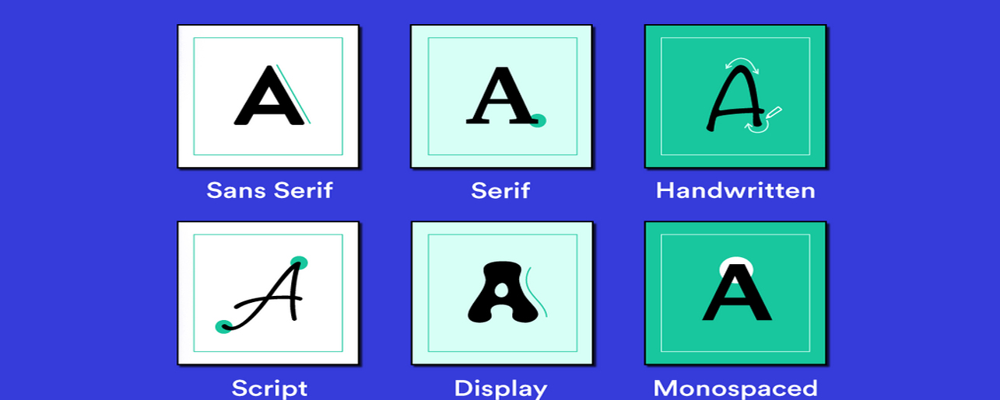

**Typefaces**

- script: handwriting style
- decorative
- monospace: occupy same space
- serif: traditional and formal
- sans serif: modern
**font-family**
This option is displayed as a list with the first being higher priority
- will fallback to the others if not installed
Generic fonts include `serif`, `sans-serif`, `monospace`, `cursive`, `fantasy`
Web-safe fonts are fonts that are installed on most devices

**font-weight**
Determines how thick or thin the characters are, value from 100 to 900
- can also be `bold` or `normal`
**font-style**
Determines if the text is italic or normal.
**font-size**
Changes the size of the text, can be in pixels, ems, or percentages
- `em` is relative to the parent element, `1em` is the same size as the parent
- `rem` is relative to the root or the html element
- the recommended is `rem` for responsive design
**text-align**
Aligns the text to the left, right, center, or justified
**text-transform**
Changes the case of the text, can be `uppercase`, `lowercase`, or `capitalize`
**line-height**
Determines the space between lines of text, can be absolute or relative
- `1.5` is 1.5 times the font size
**letter-spacing**
Determines the space between characters, can be positive or negative or relative to the font size


**Web-Fonts**
Web fonts are added to the website using the `@font-face` rule
```css
@font-face {
  font-family: 'CustomFont';
  src: url('MyCustomFont.ttf'), url('MyCustomFont.woff'),
       url('https://example.com/MyCustomFont.woff2');
}
* {
  font-family: 'CustomFont', sans-serif;
}
```
- custom fonts can be added using the `src` property 
Other custom webfonts such as Google Fonts can be added using the `link` tag in the HTML file
