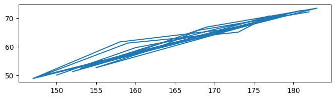
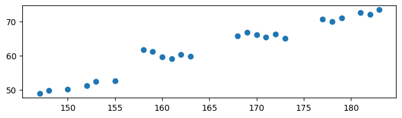
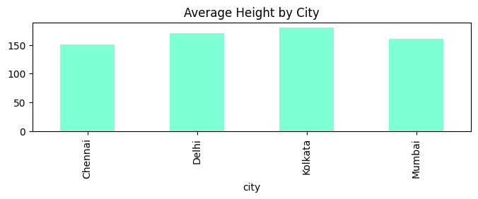
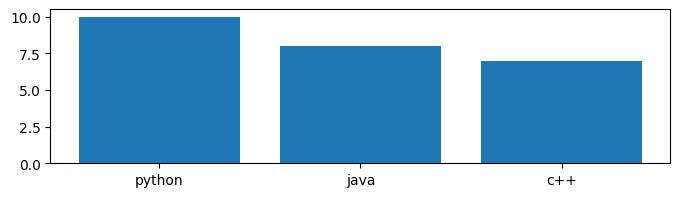
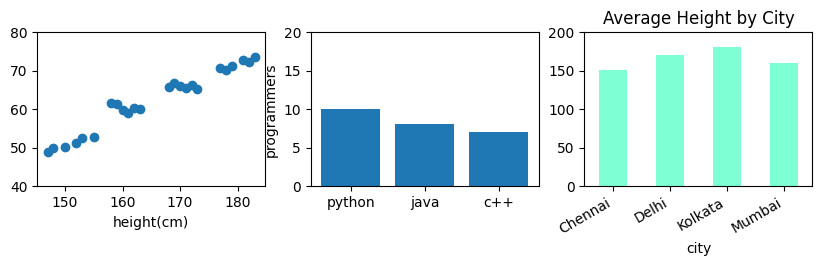

### Plotting with Matplotlib


```python
from matplotlib import pyplot as plt
import pandas as pd
```

**Basic Plotting**


```python
# prepare data
df = pd.read_csv('file.csv')
x = df['height(cm)']
y = df['weight(kg)']
# x and y can also be list of data
```


```python
fig, ax = plt.subplots()
fig.set_size_inches(8,2)
ax.plot(x,y) # Line Plot
```


    [<matplotlib.lines.Line2D at 0x1ffe53d0070>]


    

    


```python
fig, ax = plt.subplots()
fig.set_size_inches(8,2)
ax.scatter(x,y) # scatter plot
```


    <matplotlib.collections.PathCollection at 0x1ffe5401340>


    

    


```python
fig, ax = plt.subplots()
fig.set_size_inches(8,2)
ax.hist(x, bins=5) # histogram
```


    (array([5., 5., 3., 5., 6.]),
     array([147. , 154.2, 161.4, 168.6, 175.8, 183. ]),
     <BarContainer object of 5 artists>)


    

    


```python
# average height group by city (similar to excel pivot table)
z = df.groupby('city')['height(cm)'].mean()
fig, ax = plt.subplots()
fig.set_size_inches(8,2)
z.plot(title='Average Height by City', kind='bar', color='aquamarine') # bar plot
```


    <Axes: title={'center': 'Average Height by City'}, xlabel='city'>


    

    


```python
z = df.groupby('city')['height(cm)'].mean()
fig, ax = plt.subplots()
fig.set_size_inches(8,2)
dict = {'python': 10, 'java': 8, 'c++': 7}
ax.bar(dict.keys(), dict.values()) # another way to plot bar using python dictionary
```


    <BarContainer object of 3 artists>


    

    


**Multiple Subplots**


```python
fig, (ax1, ax2, ax3) = plt.subplots(1, 3)
fig.set_size_inches(10,2)
ax1.set_ylim(40, 80)
ax2.set_ylim(0, 20) # has to set ylim for both axis
ax3.set_ylim(0, 200)
ax1.scatter(x,y)
ax2.bar(dict.keys(), dict.values())
z.plot(title='Average Height by City', kind='bar', color='aquamarine', ax=ax3) # can also define axis like this
ax3.set_xticklabels(ax3.get_xticklabels(), rotation=30, ha='right') # rotate x-axis label on axis 3

# Other Chart Options
ax1.set_xlabel('height(cm)')
ax2.set_ylabel('programmers')
```


    Text(0, 0.5, 'programmers')


    

    

